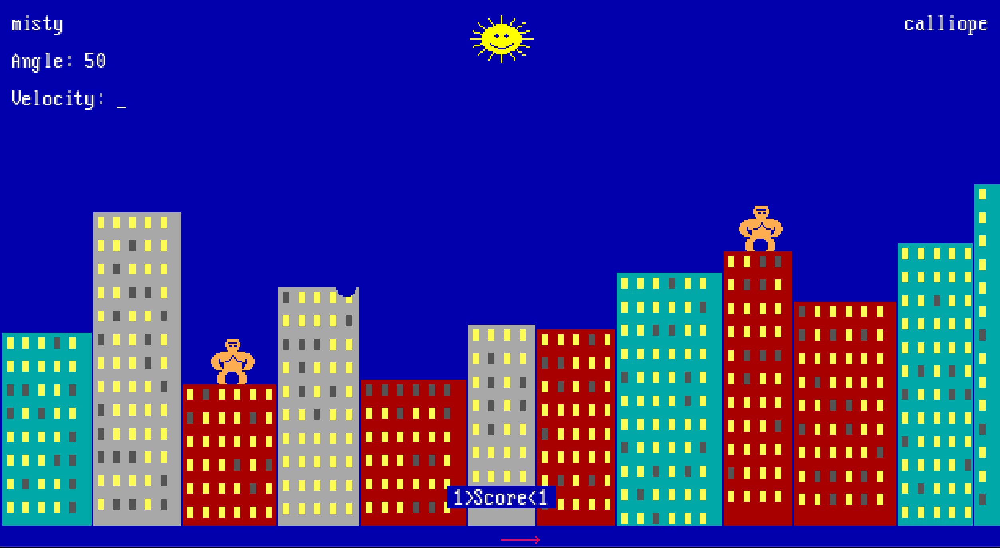

# Gorillas

[](https://github.com/w-winter/GORILLA.RS/actions/workflows/ci.yml)
[](https://github.com/w-winter/GORILLA.RS/releases/latest)

A Rust port of the first video game I played, QBasic Gorillas.  It reproduces the original's software rendering, projectile physics, QBASIC `PLAY`-string audio synthesis, and screen-by-screen game flow.



## Verification tooling

The port was developed against deterministic reference captures from the original game running in DOSBox.  Five exporters in `src/bin/` produce machine-readable outputs covering physics, rendering, scene composition, `PLAY` sequence parsing, and audio.  The scripts in `tools/` compare those outputs against the original's behavior, and `cargo test -q` tests the exporters.

## Platform support

You can play in your browser [here](https://w-winter.github.io/GORILLA.RS/), or download the [latest release](https://github.com/w-winter/GORILLA.RS/releases/latest) for your platform:

| Platform | Target | Archive |
| --- | --- | --- |
| Linux x86_64 | `x86_64-unknown-linux-gnu` | `.tar.gz` |
| Linux aarch64 | `aarch64-unknown-linux-gnu` | `.tar.gz` |
| macOS Intel | `x86_64-apple-darwin` | `.tar.gz` |
| macOS Apple Silicon | `aarch64-apple-darwin` | `.tar.gz` |
| Windows x86_64 | `x86_64-pc-windows-msvc` | `.zip` |

## Build from source

Native build:

```bash
cargo run --release --bin gorillas
```

Native verification:

```bash
cargo fmt --check
cargo test -q
```

## Platform notes

- Linux builds target desktop environments with X11, OpenGL, and ALSA available
- macOS release binaries are unsigned for now, so Gatekeeper may require an explicit "Open Anyway" approval on first launch
- Browser audio can require the first user interaction before playback begins

## Provenance and licensing

The code in this repository is dual-licensed under MIT, Apache-2.0.  That license grant covers original code and other repository-authored material only.  Reference-derived embedded data and vendored third-party files are disclosed in [`THIRDPARTY.md`](THIRDPARTY.md).  The brief attribution notice shipped with release archives is in [`NOTICE`](NOTICE).